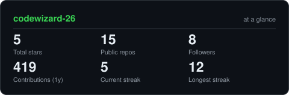
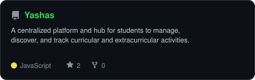
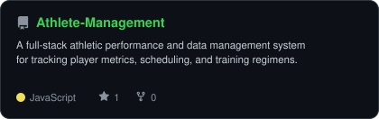
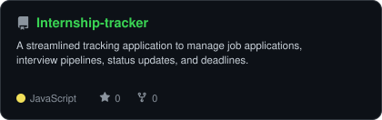
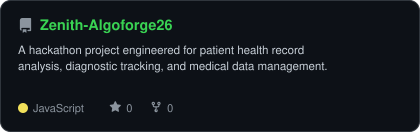

<div align="center">

<!-- PORTRAIT - generated by scripts/dotify.py from assets/Frame 1.png.
     Colour mode with row reveal scanline animation -->


<br>

<!-- NAME / TAGLINE - animated typing -->
<a href="https://github.com/codewizard-26">
  
</a>

<br>

<!-- SOCIALS & PROFILES -->
<a href="https://www.linkedin.com/in/yashwant-singh26"></a>
<a href="mailto:yashwantsinghhustles@gmail.com"></a>
<a href="https://leetcode.com/u/codewizard-26"></a>
<a href="https://codolio.com/profile/code-wizards26"></a>
<a href="https://profile.hackthebox.com/profile/01a005a8-56bf-70b2-b408-562f339ee1b3?utm_medium=copy_url"></a>
<a href="https://drive.google.com/file/d/1duetjj7pn4jE86IT8noPak7bBrHvn-4k/view?usp=drive_link"></a>

<br><br>


</div>

---

## `~/` whoami

```console
$ cat about.txt
```

I’m a software engineer in the making, driven by ambitious ideas and the challenge of turning them into real, scalable products. I enjoy exploring the intersection of **software, AI, cybersecurity, and intelligent systems**.

- 🔭 Currently building: **[Internship-tracker](https://github.com/codewizard-26/Internship-tracker)** and **[Yashas](https://github.com/codewizard-26/Yashas)**
- 📚 Currently learning / exploring: **Full-stack engineering, DSA & system design, and cybersecurity**
- 🎯 Working towards: **Becoming a high-impact software engineer who can build technically strong products from idea to scale**
- 💬 Motto: *"Stay curious. Think big. Build relentlessly."*

<br>

<div align="center">

## `~/` toolbox


</div>

---

<div align="center">

## `~/` skill radar

<table width="100%">
<tr>
<td width="50%" align="center" valign="middle">

<!-- Self-rated radar - edit assets/skills.json to change it -->
<picture>
  <source media="(prefers-color-scheme: dark)"  srcset="assets/radar-dark.svg">
  <source media="(prefers-color-scheme: light)" srcset="assets/radar-light.svg">
  
</picture>

</td>
<td width="50%" align="center" valign="middle">

<!-- Language mix radar - edit assets/languages.json or refreshed by GitHub Actions -->
<picture>
  <source media="(prefers-color-scheme: dark)"  srcset="assets/radar-langs-dark.svg">
  <source media="(prefers-color-scheme: light)" srcset="assets/radar-langs-light.svg">
  
</picture>

</td>
</tr>
</table>

</div>

---

<div align="center">

## `~/` contribution calendar

<!-- 3D isometric calendar, regenerated every 6h by .github/workflows/metrics.yml -->


<br><br>

<!-- Snake eats the contribution graph -->
<picture>
  <source media="(prefers-color-scheme: dark)"  srcset="assets/snake-dark.svg">
  <source media="(prefers-color-scheme: light)" srcset="assets/snake.svg">
  
</picture>

</div>

---

<div align="center">

## `~/` the numbers

<!-- Self-hosted stats card generated by scripts/cards.py -->
<picture>
  <source media="(prefers-color-scheme: dark)"  srcset="assets/card-stats-dark.svg">
  <source media="(prefers-color-scheme: light)" srcset="assets/card-stats-light.svg">
  
</picture>

<br><br>


</div>

---

<div align="center">

## `~/` selected work

<!-- Cards generated by scripts/cards.py from assets/projects.json -->
<table width="100%">
<tr>
<td width="50%" align="center">
  <a href="https://github.com/codewizard-26/Yashas">
    <picture>
      <source media="(prefers-color-scheme: dark)"  srcset="assets/card-Yashas-dark.svg">
      <source media="(prefers-color-scheme: light)" srcset="assets/card-Yashas-light.svg">
      
    </picture>
  </a>
</td>
<td width="50%" align="center">
  <a href="https://github.com/codewizard-26/Athlete-Management">
    <picture>
      <source media="(prefers-color-scheme: dark)"  srcset="assets/card-Athlete-Management-dark.svg">
      <source media="(prefers-color-scheme: light)" srcset="assets/card-Athlete-Management-light.svg">
      
    </picture>
  </a>
</td>
</tr>
<tr>
<td width="50%" align="center">
  <a href="https://github.com/codewizard-26/Internship-tracker">
    <picture>
      <source media="(prefers-color-scheme: dark)"  srcset="assets/card-Internship-tracker-dark.svg">
      <source media="(prefers-color-scheme: light)" srcset="assets/card-Internship-tracker-light.svg">
      
    </picture>
  </a>
</td>
<td width="50%" align="center">
  <a href="https://github.com/codewizard-26/Zenith-Algoforge26">
    <picture>
      <source media="(prefers-color-scheme: dark)"  srcset="assets/card-Zenith-Algoforge26-dark.svg">
      <source media="(prefers-color-scheme: light)" srcset="assets/card-Zenith-Algoforge26-light.svg">
      
    </picture>
  </a>
</td>
</tr>
</table>

</div>

---

<div align="center">

<sub>`01110100 01101000 01100001 01101110 01101011 01100011 00100000 01100110 01101111 01110010 00100000 01110011 01100011 01110010 01101111 01101100 01101100 01101001 01101110 01100111`</sub>

</div>
